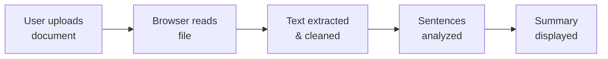

# Document Summary Assistant

A **fast, privacy-focused web application** for summarizing text documents directly in your browser—no servers, no API keys, no sign-ups.

---

## ✨ Why Use This?

- **Instant summaries** → Process documents faster than reading the full text
- **100% private** → All processing happens locally on your device
- **No dependencies** → Works offline, no installation needed
- **Simple UI** → Upload or drag-and-drop, get results instantly

---

## 🚀 Quick Start

1. Open `index.html` in your web browser
2. Upload a text file (`.txt`, `.md`, etc.) or drag it into the upload area
3. View your summary instantly

---

## 📋 Features

### Core Functionality
- **Flexible file upload** – File picker or drag-and-drop interface
- **Automatic text extraction** – Reads `.txt`, `.md`, and similar text files
- **Intelligent summarization** – Rule-based algorithm identifies key sentences
- **Text normalization** – Cleans whitespace and prepares content for analysis

### User Experience
- **Real-time feedback** – Loading, success, and error states
- **Responsive design** – Works on desktop, tablet, and mobile
- **No external dependencies** – Runs entirely in the browser
- **Error handling** – Clear messages for unsupported files or processing issues

---

## 📂 Project Structure

```text
Document-Summary-Assistant/
├── index.html          # Application markup & DOM structure
├── style.css           # Layout, responsive design, & styling
├── script.js           # Core logic: file reading, processing, summarization
└── README.md           # This file
```

---

## 🔧 How It Works



### Step-by-Step Process

1. **File Selection** – User provides a text document via upload or drag-and-drop
2. **Text Extraction** – JavaScript reads the file using the browser File API
3. **Text Processing** – Content is normalized (whitespace removed, text standardized)
4. **Sentence Analysis** – Text is split into sentences and scored based on relevance
5. **Summary Generation** – Top-scoring sentences are combined into a concise summary
6. **Result Display** – Summary is rendered with document metadata

---

## 🛠️ Technologies

| Technology | Purpose |
|------------|---------|
| **HTML5** | Document structure, file input, result containers |
| **CSS3** | Layout, responsive design, component states |
| **JavaScript (ES6+)** | File API integration, text processing, DOM manipulation |
| **File API** | Client-side file reading & processing |
| **DOM API** | Dynamic UI updates & state management |

---

## ⚙️ Requirements

### Browser Compatibility
- ✅ Chrome/Edge 90+
- ✅ Firefox 88+
- ✅ Safari 14+
- ✅ Any browser with ES6 and File API support

### File Support
- `.txt` (plain text)
- `.md` (markdown)
- `.json` (if contains readable text)
- Other text-based formats

---

## 📝 Usage Examples

### Scenario 1: Student Reviewing Notes
```
Input: 2,000-word lecture notes
Output: 150-word key summary in seconds
```

### Scenario 2: Professional Scanning Reports
```
Input: 10-page quarterly report
Output: Executive summary with main findings
```

### Scenario 3: Email Digest
```
Input: Long email thread
Output: Concise action items & key points
```

---

## ⚠️ Limitations & Known Behavior

- **Summarization quality** varies by document type (lists, code, structured data may not summarize well)
- **Large files** (500+ MB) may impact browser performance
- **Offline only** – No network features or cloud sync
- **No file size limit enforcement** (depends on available browser memory)
- **Best for prose** – Works optimally with narrative text, articles, and reports

---

## 🔐 Privacy & Security

- ✅ No data sent to external servers
- ✅ No cookies or tracking
- ✅ No account creation needed
- ✅ Documents remain on your device only
- ✅ Fully compliant with privacy expectations

---

## 💡 Tips for Better Results

1. **Use complete sentences** – Algorithm scores based on sentence structure
2. **Avoid highly technical jargon** – May reduce summary accuracy
3. **Provide context** – Documents with clear topic sentences summarize better
4. **Check file format** – Plain text works best; formatted documents may lose structure

---

## 🤝 Contributing

Found a bug? Want to suggest a feature? Feel free to:
- Report issues with specific document examples
- Suggest improvements to the summarization algorithm
- Recommend UI/UX enhancements

---

## 📄 License

MIT License – Feel free to use, modify, and distribute this project.

---

## 🎯 Future Enhancements

- [ ] Adjustable summary length slider
- [ ] Support for PDF and DOCX files
- [ ] Multiple summarization algorithms
- [ ] Export summary as `.txt` or `.md`
- [ ] Dark mode toggle
- [ ] Document history (local storage)

---

## 📞 Support

Have questions? Check the features section or open an issue with:
- The document you tested with
- The expected vs. actual summary
- Your browser and OS version

Happy summarizing! 📚

my portfolio : https://premkr.vercel.app/
leet code : https://leetcode.com/u/Prem_kumar_18/
